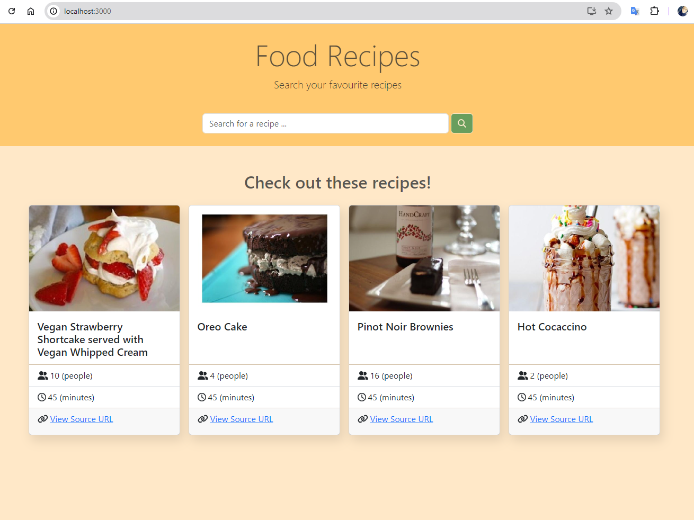
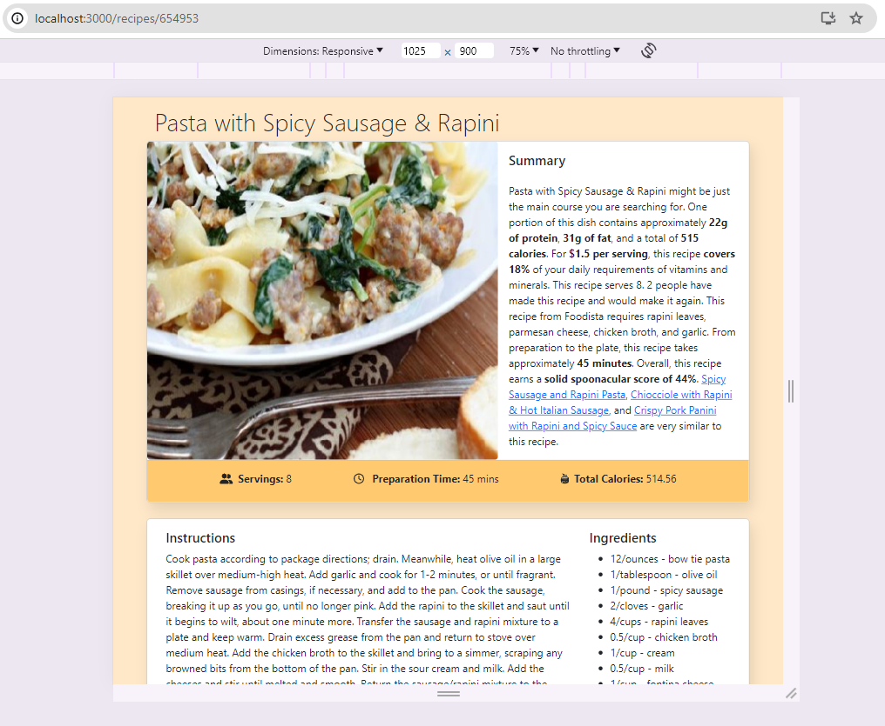
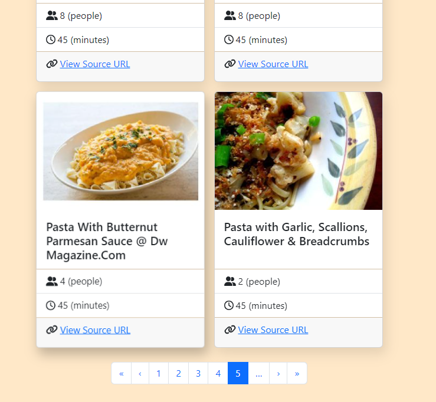

# Food Recipes App

This is a simple web application that allows you to search for different food recipes by integrating
with an external API [Spoonacular.com](https://spoonacular.com/food-api). The application is built
with Spring boot and ReactJS.

## Requirements

### Running the API on local dev machine requires:

1. Java (1.8+).
2. Apache Maven (3.8.7+).

### Running the UI on local dev machine requires:

1. Node.js [Download here](https://nodejs.org/en)

## Steps to Run the Application

1. Clone the repository to your projects' directory.

2. Before running the backend server, you need to specify a private API key for Spoonacular. The
   private key can be found at your Dashboard page after signing up to Spoonacular.com. Add the key
   to the [application-dev.yml](backend/src/main/resources/application-dev.yml) file under the path:
   `spoonacular.api.key=YOUR_PRIVATE_API_KEY`
   Note that `application-dev.yml` is added to `.gitignore` file, so it's better keep this file
   local and not sharing your private key with others.


3. Run the API using Maven command:

   Inside the project directory run the following commands:
    ```
    $ cd backend
    $ mvn clean install
    $ mvn clean compile
    $ mvn spring-boot:run -Dspring-boot.profiles.active=dev
    ```
   The app will start at the port specified in the `application.yml` file that will be shown on your
   command prompt:
   `Tomcat initialized with port 8080 (http)`


4. Run the UI using Node.js
    ```
    $ cd frontend
    $ npm ci
    $ npm start
    ```
   The app will start at default port that will be shown on your command prompt:
   e.g. http://localhost:3000

## Available Endpoints

You can check the available endpoints using Postman or any other API testing tool.

| Endpoint                                     | Method | Path                             | Params                                                                                                                           | Spoonacluar API call                                                                                      | Example                                                                                      |
|----------------------------------------------|--------|----------------------------------|----------------------------------------------------------------------------------------------------------------------------------|-----------------------------------------------------------------------------------------------------------|----------------------------------------------------------------------------------------------|
| Search recipes                               | GET    | /api/recipes/search              | query: searchQuery (Required)<br/>page: active results page (default:1)<br/>pageSize: results page size (default:10)             | https://api.spoonacular.com/recipes/complexSearch?query=pasta&number=1&offset=0&addRecipeInformation=true | http://localhost:8080/api/recipes/search?query=pasta&page=1&pageSize=10                      |
| Get recipe's information                     | GET    | /api/recipes/{recipeId}          | Path param: recipeId                                                                                                             | https://api.spoonacular.com/recipes/602638/information?includeNutrition=true                              | http://localhost:8080/api/recipes/602638                                                     |
| Get total calories with excluded ingredients | GET    | /api/recipes/{recipeId}/calories | Path param: recipeId<br/>Request param: excludedIngredients (comma separated list of ingredients to be excluded from the recipe) | https://api.spoonacular.com/recipes/602638/nutritionWidget.json                                           | http://localhost:8080/api/recipes/602638/calories?excludedIngredients=butter,parmesan cheese |
| Get random recipes                           | GET    | /api/recipes/random              | --                                                                                                                               | https://api.spoonacular.com/recipes/random                                                                | http://localhost:8080/api/recipes/random                                                     |

## Features and Considerations

While developing this application, I focused on several key features and best practices to ensure a
high-quality product:

* Best Practices and Naming Conventions:
  Adhered to industry-standard coding practices and naming conventions to maintain clean and
  readable code.
* Responsive Design:
  Ensured that the UI is fully responsive and works seamlessly across different screen sizes,
  providing a consistent user experience on mobile, tablet, and desktop devices.
* Custom Pagination Component:
  Implemented a pagination component which inherits React's pagination component, writing all its
  logic independently. I included it to deepen my understanding of React functionalities and hooks.
* Simple Yet Styled UI:
  Delivered a simple yet styled application with attention to styling, ensuring that the app is
  visually appealing and user-friendly.

## Preview
### Home Page



### Recipe Information Page


### Search Results Pagination


## Challenges

One of the significant challenges I faced while developing this application was learning ReactJS
from scratch within a short timeframe, I followed the official documentation to grasp core ReactJS
concepts, supplemented by a summary book and video materials. I quickly acquired the necessary
knowledge to create a functional application while adhering to best coding practices. However, my
journey didn't stop there; I found ReactJS very interesting and I discovered comprehensive materials
and resources to master it. I am enthusiastic about continuing to learn and enhance my skills in
ReactJS.

## Contact

For any inquiries, please do not hesitate to contact me at: `areej.qadomi94@gmail.com`
